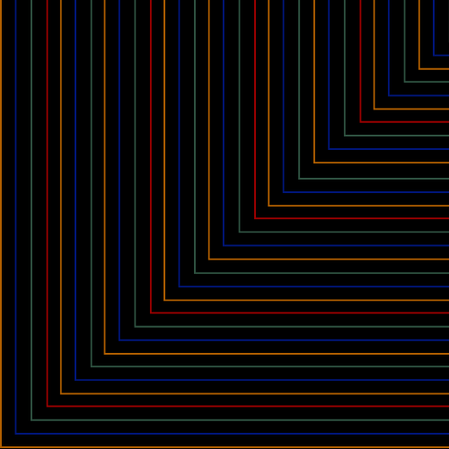

<!-- LS BADGES START -->

  
  
  

<!-- LS BADGES END -->

  

  

# playlens

## what this is
a control to test one screen and user behavior, show the change, and re-test. before → fix → after.

## why it matters
- replaces opinions with measured data
- focuses on one change at a time
- creates shareable, timed “before/after” clips

## try it in 5 minutes
1) open **/docs/SETUP.md**  
2) run the sample flow (seed data provided)  
3) record a 60–90s before/after clip (script included)

## demo
- 60–90s clip: **/demo/playlens-v0.mp4** *(placeholder)*

## measures (v0)
- time to complete
- errors/cancels
- “felt easy?” 3-question pulse

## roadmap (next 4 weeks)
- [ ] wk1: sample task + timing + csv logger
- [ ] wk2: simple chart + markdown report
- [ ] wk3: variant toggle (a/b)
- [ ] wk4: “share report” one-pager export

## status + links
- setup: **/docs/SETUP.md**
- test script: **/docs/TEST-PLAN.md** *(placeholder)*
- license: **MIT**

---

  

  

